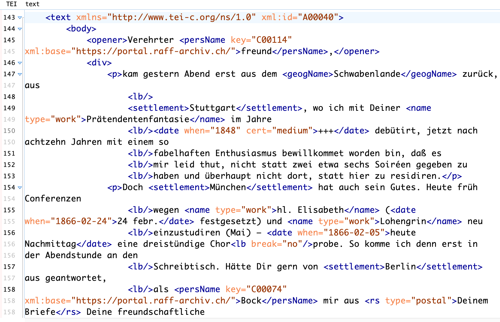
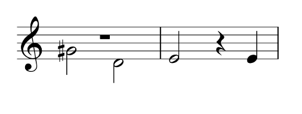
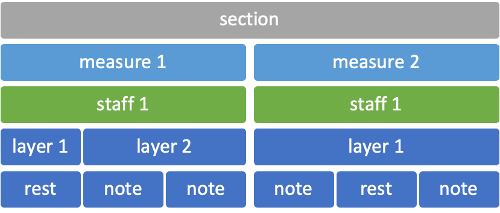

<!--
author:   Dennis Ried
email:    dennis.ried@musikwiss.uni-halle.de
version:  1.0.0
language: de
narrator: Deutsch Female
import:   ../liascript-config.md
link:     ../liascript-style.css
link:     https://fonts.googleapis.com/css2?family=Source+Sans+3:ital,wght@0,200..900;1,200..900&display=swap
font:     Source Sans 3
tags:     digitalitaet, formte, zeichencodierung
-->

# Musikcodierung



## Codierungsformate

{{0}}
*********************************
> Welche Formate zur Darstellung von Musik kennt ihr?
*********************************

{{1}}
*********************************
- ABC

  {{2}}
  - Ziel: einfache Eingabe
  - Fokus: Inhalt
  - https://abcnotation.com/

- Plain and Easy

  {{3}}
  - Est. 1964
  - Ziel: einfache Eingabe
  - Fokus: Inhalt
  - [https://plaine-and-easie.info](https://plaine-and-easie.info/v2/)

- Braille Musical Notation

  {{4}}
  - Roger Firman: \[Capter\] *22 Braille Musical Notation (1): An Overview*, in: *Beyond MIDI*, S. 333–332

- Lilypond

  {{5}}
  - Ziel: ästhetisches Druckbild
  - Fokus: Erscheingungsform (& Inhalt!)
  - [https://lilypond.org](https://lilypond.org/index.de.html)
  - [Notenschriftarten](https://lilypond.org/doc/v2.26/Documentation/essay-big-page#music-fonts)

- HumDrum

  {{6}}
  - Ziel: Analyse ([What Can Humdrum Do?](https://www.humdrum.org/guide/ch01/index.html#what-can-humdrum-do))
  - Fokus: Inhalt
  - https://www.humdrum.org/
  - Eigenes Toolkit

- MIDI

  {{7}}
  - Ziel: Steuerung elektr. Instrumente
  - Fokus: Signalverarbeitung
  - > MIDI, an acronym for the Musical Instrument Digital Interface, has taken on multiple meanings. It may refer to a hardware interface, a file format, the data in a Standard MIDI File, or the instrumental simulation specifications of General MIDI. The ubiquity of the term is not necessarily matched by uniformity of operations, nor by interchangeability of data without some loss of information, nor by applications without some limitation of capabilities. A great many proprietary extensions have been developed by individual manufacturers. Defaults make it possible to use MIDI data on diverse machines, but they do not always produce results that are identical.
    > 
    > – Walter B. Hewlett/Eleanor Selfridge-Field: \[Capter\] *2 MIDI*, in: Eleanor Selfridge-Field (Hg.): *Beyond MIDI*, Cambridge(MS)/London 1997, S. 41

- MusicXML

  {{8}}
  - Est. anfang der 2000er, Michael Good (Version 1.0, 2004)
  - https://www.w3.org/2021/06/musicxml40/ (Version 4.0, 2021)
  - > MusicXML is a standard open format for exchanging digital sheet music. It is designed for sharing sheet music files between applications, and for archiving sheet music files for use in the future. As of this publication date it is supported by over 250 applications.
    > 
    > – https://www.w3.org/2021/06/musicxml40/ \[18.05.2026\]

- MEI

  {{9}}
  - Est. 1999, Perry D. Roland
  - https://music-encoding.org/
  - [MEI 5.1 Guidelines](https://music-encoding.org/guidelines/v5/content/index.html)
  - Eigene Tools
    
    - mei-friend [Online-Editor](https://mei-friend.mdw.ac.at/)
    - verovio [A music notation engraving library](https://www.verovio.org/index.xhtml)

*********************************


## Music Encoding Initiative

- Est. 1999 (Perry D. Roland)
- Seit 2009 ein *de facto*-Standard für Musikcodierung in der wiss. Community
- Das vielseitigste XML-basierte Format zur Musikkodierung
- Kein organisatorischer Zusammenhang zur Text Encoding Initiative
  
  - aber viele inhaltlichen Parallelen
  - Übernahme zahlreicher Konventionen

- Framework zur maschinenlesbaren Repräsentation musikbezogener Dokumente
- Fokus liegt auf wissenschaftlichen Anforderungen (kritischer Editionen)
- Unterstützt verschiedene Kodierungsansätze
  
  - viele Lösungen für ein Problem

- Zahlreiche Module decken unterschiedliche Verwendungszwecke ab, z.B.:

  - Common Western Music Notation (CMN → Moderne Musiknotation)
  - Neumen
  - Mensuralnotation
  - Editorial Markup & Critical Apparatus
  - Einbindung von Faksimiles oder Tonaufnahmen

### Minimales MEI
```xml
<?xml version="1.0" encoding="UTF-8"?>
<?xml-model href="https://music-encoding.org/schema/4.0.1/mei-CMN.rng" type="application/xml" schematypens="http://relaxng.org/ns/structure/1.0"?>
<mei xmlns="http://www.music-encoding.org/ns/mei" meiversion="4.0.1">
 <meiHead>
   <fileDesc>
     <titleStmt>
       <title>Test file</title>
     </titleStmt>
     <pubStmt></pubStmt>
   </fileDesc>
 </meiHead>
 <music></music>
</mei>
```

### Bereiche der MEI-Datei

- `meiHead`

  - Beinhaltet Metadaten
  - Daten zur Datei selbst
  - Informationen zu Werken, Fassungen, Quellen
  - Informationen zur Kodierung

- `music`

  - Eigentlicher Dateiinhalt
  - Kodierte Musik
  - Verweise zu Regionen in Digitalisaten
  - Verweise zu Abschnitten in Tonaufnahmen
  - Kodierung von Textbestandteilen wie Titelblättern etc.

### Musik(notation) als XML

- Lineare Ereigniskette wird in hierarchische Baumstruktur übersetzt.
- Strukturierende Elemente gruppieren die Ereigniskette.
- Jedes Element und damit jedes musikalische Ereignis hat eine eindeutige Stelle im Baum.

### Musikalische Binnenstruktur

{{0}}
************************************

************************************

{{1}}
************************************
---



{{2}}
- Zusammenhängender musikalischer Text konstituiert sich üblicherweise durch Beziehungen zwischen den musikalischen Elementen
- Zusätze zu einer Note (Akzidenzien, Punkte etc.) werden in CMN (common music notation) als deren Attribute oder Kind-Elemente notiert
- Verweise zwischen eindeutigen Elementen möglich

************************************
{{3}}
************************************
---

<iframe style="width:100%; min-height: 750px;" src="https://mei-friend.mdw.ac.at/" title="MEI-friend"></iframe>

************************************

# Literatur & Links
  
* XML: https://www.w3schools.com/xml/
* MEI-Guidelines: https://music-encoding.org/guidelines/v5/content/index.html
* MEI Tutorials: https://music-encoding.org/resources/tutorials.html
* MEI-Mailingliste: https://music-encoding.org/community/community-contacts.html
* MEI-Interesst Groups: https://music-encoding.org/community/interest-groups.html
* Music Encoding Conference: https://music-encoding.org/conference/2026/
* Eleanor Selfridge-Field (Hg.): *Beyond MIDI. The Handbook of Musical Codes*, Cambridge(MS)/London 1997
* Proceedings of the Music Encoding Conferences, https://music-encoding.org/conference/proceedings.html